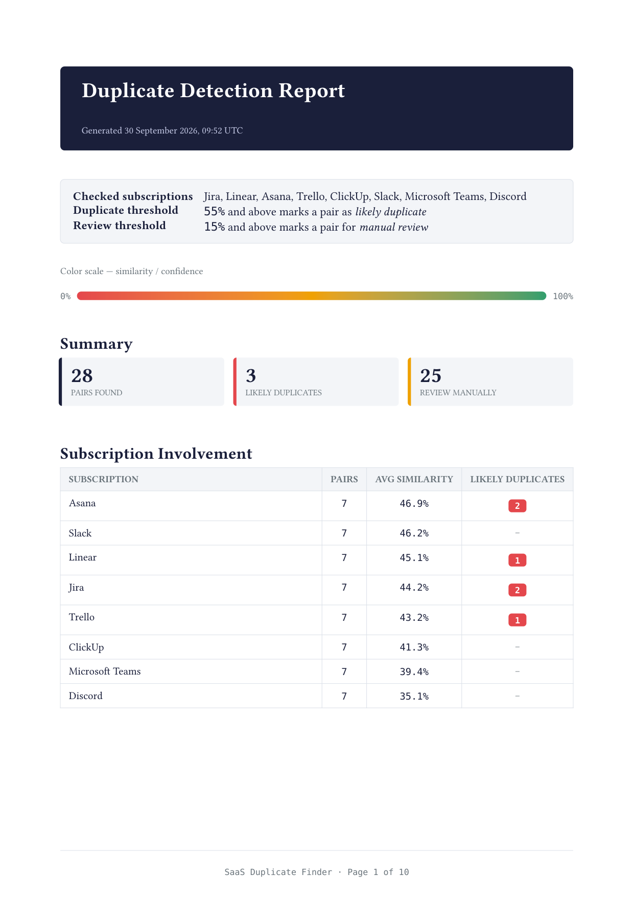
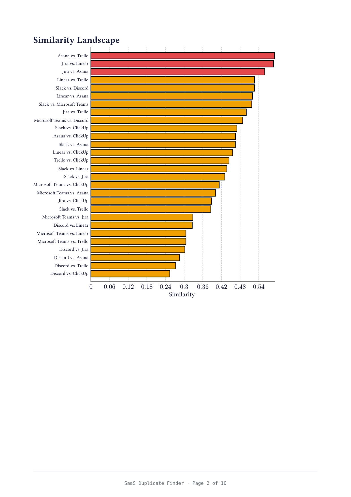
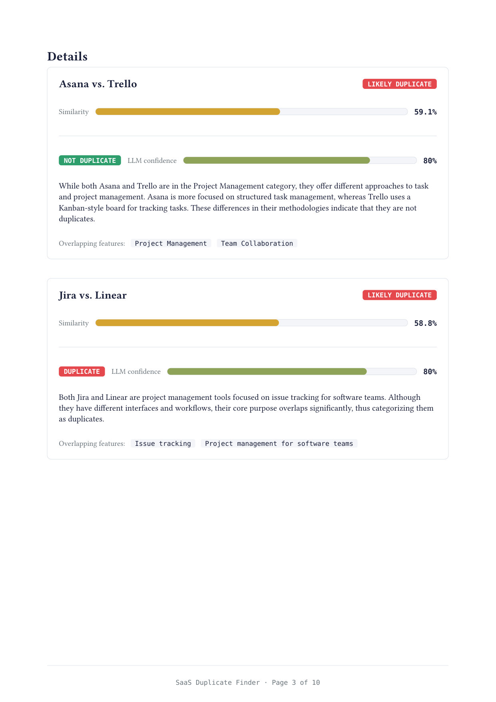

# 🔍 SaaS Duplicate Finder

A playground project for detecting duplicate SaaS subscriptions in a company's software catalog — built to practice (and show off) async Python, `pydantic_ai`, embeddings, a Rust microservice, and a resilient SQS-backed job pipeline.

> 🤖 Built together with **[Claude Code](https://claude.com/claude-code)**.

---

## 📖 About

Companies accumulate SaaS subscriptions over time, and it's easy to end up paying for two tools that do the same thing (e.g. two project-management apps, two design tools). **SaaS Duplicate Finder** takes a list of subscription names and:

1. **Classifies** each one into a category (Communication, Design, Security, …) using an LLM agent.
2. **Embeds** its name + description (OpenAI embeddings, cached in Postgres so the same text is never embedded twice).
3. **Compares** items pairwise via cosine similarity over those embeddings (`pgvector`) and flags likely duplicates.
4. **Explains** a flagged pair in plain language, using an LLM agent that can look up catalog details as a tool call.
5. **Generates a PDF report** of a full duplicate-detection run — rendered by a separate Rust service using **Typst**.

It's deliberately over-engineered in places (a proper outbox/retry pipeline, a heartbeat mechanism, a two-language service split) — that's the point: it's a space to practice patterns that are easy to read about but only really click once you've built and broken them yourself.

---

## 🏗️ Services

| Service | Language | Role |
|---|---|---|
| `api` | Python / FastAPI | Public HTTP surface — see [API Reference](#-api-reference) below |
| `dispatcher` | Python | Polls `requests` for `PENDING` rows and pushes them onto the right SQS queue |
| `catalog-worker` | Python | Consumes the catalog-creation queue — classification + embedding → `software_items` |
| `report-service` | Rust | Consumes the report-generation queue — renders a Typst PDF, uploads it to S3 |
| `migrate` | Python | One-shot `alembic upgrade head`, runs once before everything else starts |
| `postgres` | — | `pgvector`-enabled Postgres: catalog, embeddings, request/attempt bookkeeping |
| `localstack` | — | Local SQS + S3 emulator (prod would point these at real AWS) |
| `redis` | — | Backing store for API rate limiting |

### 🔁 How a request survives failure

Every async job (catalog creation, report generation) goes through the same lifecycle: `PENDING → QUEUED → PROCESSING → COMPLETED` (or `FAILED`, which — importantly — **isn't terminal**). A few things worth calling out:

- **SQS is the only retry authority.** There's no app-level `max_attempts` counter living alongside SQS's own `RedrivePolicy` — one source of truth, no drift between the two.
- **A `FAILED` request can still succeed later.** It just means "this attempt didn't work" — the row stays claimable, so if SQS redelivers (or a DLQ message gets redriven), a later attempt can carry it all the way to `COMPLETED`.
- **Redriving a DLQ message is a pure SQS→SQS move — zero database writes.** Keeps two independently-failing systems (Postgres, SQS) from ever needing a coordinated write.
- **A heartbeat keeps long-running attempts alive** by periodically extending *both* the Postgres row lock and the SQS visibility timeout — important for `report-service`, where a cold Typst package cache can mean a slow first render.
- Every attempt is recorded in `request_attempts`, so the full retry history is always inspectable, even for a request that eventually succeeded on try #4.

---

## 🔌 API Reference

Full interactive docs live at `/docs` (Swagger UI) once the API is running.

### Catalog

| Method & Path | What it does |
|---|---|
| `POST /api/v1/catalog` | Queue a new subscription for classification + embedding (returns `202` + `request_id`) |
| `GET /api/v1/catalog` | List everything in the catalog |
| `GET /api/v1/catalog/{item_id}` | Fetch a single catalog item |
| `GET /api/v1/catalog/{item_id}/similar` | Nearest neighbors by embedding cosine similarity (`pgvector`) |
| `GET /api/v1/catalog/requests/{request_id}` | Poll the status of any async request (catalog creation *or* report generation) |

### Duplicate detection

| Method & Path | What it does |
|---|---|
| `POST /api/v1/find-duplicates` | Given a list of subscription names, pairwise-compares them and returns a verdict per pair (`LIKELY_DUPLICATE` / `REVIEW_MANUALLY`) |
| `POST /api/v1/explain-duplicate` | Given a `pair_id` from the check above, asks an LLM agent to explain *why* (or why not) — the agent can call a tool to pull catalog details for context |
| `POST /api/v1/classify` | Classify a single name + description on demand (rate-limited, 10/min) |

### Reports

| Method & Path | What it does |
|---|---|
| `POST /api/v1/generate-report` | Queue a PDF report for a completed duplicate-detection check (returns `202` + `request_id`) |
| `GET /api/v1/reports/{request_id}/url` | Get a presigned S3 URL for the finished PDF |

**Typical flow:** `POST /catalog` a few subscriptions → `POST /find-duplicates` with their names → `POST /explain-duplicate` on any pair you want detail on → `POST /generate-report` with the check's ID → poll `/catalog/requests/{id}` → grab the PDF from `/reports/{id}/url`.

---

## 🛠️ Tech Stack

**Python side**
- **FastAPI** + **Uvicorn** — the API itself, async end to end
- **SQLAlchemy 2.0 (async)** + **asyncpg** + **Alembic** — ORM, driver, migrations
- **pgvector** — stores embeddings directly in Postgres, cosine-similarity search with no separate vector DB
- **pydantic_ai** — typed LLM agents (structured output, output validators with retry, tool calling) for classification and duplicate explanations
- **OpenAI** — embeddings + chat completions, behind `pydantic_ai`
- **aioboto3** — async SQS/S3 client
- **slowapi** + **Redis** — rate limiting
- **uv** — dependency management and the project's build backend
- **Logfire** — tracing/observability (gracefully degrades to local-only logging if no token is configured — handy in containers)

**Rust side (`report-service`)**
- **tokio** + **sqlx** + **aws-sdk-sqs** / **aws-sdk-s3** — async runtime, typed Postgres queries, SQS/S3 clients
- **Typst** — see below 👇

### 📄 Why Typst?

`report-service` renders its PDF reports with **[Typst](https://typst.app/)** instead of the more traditional LaTeX-via-shell-out approach, for a few concrete reasons:

- **It's a library, not a system dependency.** `typst`/`typst-pdf` are just Rust crates — there's no multi-gigabyte TeX distribution to install or manage inside the Docker image, and no shelling out to an external `pdflatex` binary.
- **Fast.** Compilation is incremental and typically sub-second, even for a multi-page report with a rendered chart.
- **A genuinely modern syntax.** It reads closer to Markdown with real functions, loops, and conditionals than to LaTeX's macro-expansion model — writing a data-driven template (JSON in, PDF out) feels like writing code, not fighting a typesetting DSL.
- **Native vector graphics**, via the [`cetz`](https://typst.app/universe/package/cetz) package — the report's bar chart is drawn *in* the document itself, not stitched in as an external image.
- **Real pagination control**, without hacks. A native `table()` breaks across pages with a repeating header via `table.header()`; a `block(breakable: false, …)` lets Typst push a whole chart to the next page automatically *only if it doesn't fit* — no forced `pagebreak()` wasting half a page.
- **Error messages you can actually act on**, instead of LaTeX's famously cryptic log output.

---

## 🖼️ Example Output

A v2 report generated for an 8-subscription check (Jira, Linear, Asana, Trello, ClickUp, Slack, Microsoft Teams, Discord) — 28 pairs compared, 3 flagged as likely duplicates:

**Page 1 — Summary & Subscription Involvement**


**Page 2 — Similarity Landscape (ranked bar chart, drawn natively with `cetz`)**


**Page 3 — Pair details, with LLM-generated reasoning per pair**


📄 [Download the full 10-page PDF](docs/examples/duplicate-report-v2-example.pdf)

---

## ⚙️ Local Development

### Quickest path: Docker Compose

```bash
cp .env.example .env
# fill in AI__OPENAI_API_KEY at minimum — everything else has a sane local default
docker compose up --build
```

This brings up Postgres (`pgvector`), LocalStack (SQS + S3), Redis, runs migrations once, then starts `api`, `dispatcher`, `catalog-worker`, and `report-service`. The API is at **http://localhost:8000/docs**.

### Running natively (faster iteration loop)

```bash
# Python side
uv sync
docker compose up -d postgres localstack redis   # just the infra
uv run alembic upgrade head
uv run uvicorn main:app --app-dir src --reload    # the API
uv run python -m src.dispatcher                   # in another shell
uv run python -m src.worker                       # in another shell

# Rust side
cd report-service
cargo run
```

### Useful commands

```bash
make check                 # ruff + ty + pytest (Python)
cd report-service && cargo clippy --all-targets -- -D warnings && cargo fmt --check

uv run python -m src.dlq_tool               # dry-run: what would redrive from the catalog-creation DLQ?
uv run python -m src.dlq_tool --apply       # actually redrive it
```

---

## ⚖️ Trade-offs & Known Limitations

This is a learning/portfolio project, so a few corners were cut on purpose — worth being upfront about:

- 🔐 **No authentication.** Every endpoint is wide open. It wasn't in scope for what this project set out to practice, but it'd be a localized change rather than a rewrite — the API already runs everything through FastAPI's `Depends()` injection, so an auth dependency would slot in the same way the rate limiter already does.
- 🗄️ **Migrations run as a throwaway `migrate` container**, not folded into the API's own startup. Simpler to reason about (one process, one job, a clean exit code) — but a real production setup with multiple `api` replicas would need proper coordination (a lock, or a dedicated migration step in CI/CD) instead of "just run it once and hope."
- 🦀 **`report-service` lives in this same repo.** It's a genuinely separate service — different language, different toolchain, different deploy cadence — so in a real system it'd be its own repository with its own CI/CD. It's here as a subdirectory purely because this is one person's portfolio project, not a team's infrastructure.
